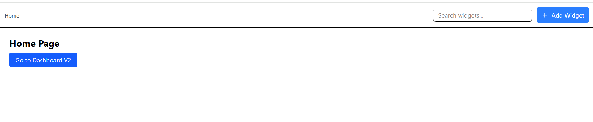
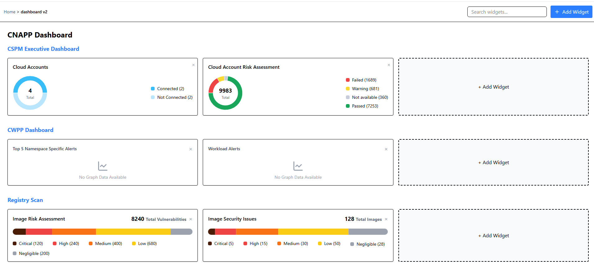
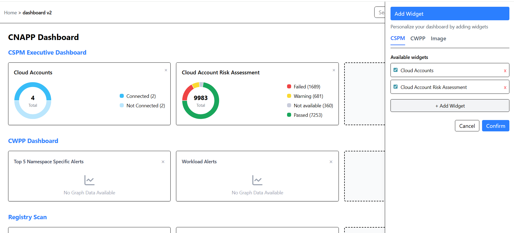
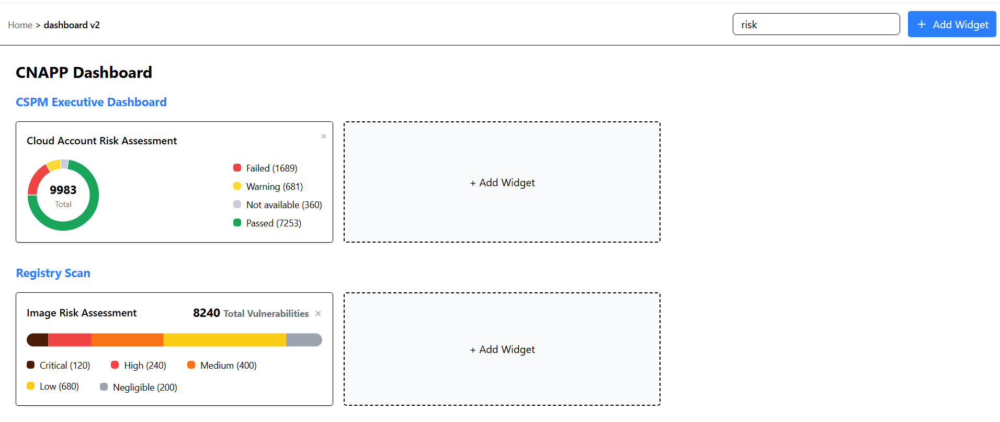

# React Analytics Dashboard

A modern, responsive analytics dashboard built with React featuring multiple widget categories, dynamic widget management, and a clean user interface.

## Dashboard Screenshots

#Home Page


#Dashboard Page


#Add Widget


#Search Filter


## ✨ Features

### Widget Management

- **Multiple Categories**: CSPM, CWPP, and Registry Scan dashboards
- **Dynamic Widgets**: Add, remove, and customize widgets in real-time
- **Search Functionality**: Filter widgets across all categories
- **Interactive Charts**: Donut charts, line graphs, and registry visualizations

### User Interface

- **Responsive Design**: Fully responsive layout using Tailwind CSS
- **Breadcrumb Navigation**: Easy navigation through dashboard sections
- **Clean & Modern UI**: Consistent design language throughout
- **Interactive Controls**: Intuitive widget management panel

### Technical Features

- **State Management**: Centralized state handling with Redux Toolkit
- **Routing**: Client-side routing with React Router
- **Component Architecture**: Reusable and maintainable component structure
- **Modern Tooling**: Built with latest React features and best practices

## 🚀 Installation

1. Clone the repository:

```bash
git clone https://github.com/yourusername/react-analytics-dashboard.git
cd react-analytics-dashboard
```

2. Install dependencies:

```bash
npm install
# or
yarn install
```

3. Start the development server:

```bash
npm run dev
# or
yarn dev
```

## 📖 Usage

### Accessing the Dashboard

1. Navigate to the application in your browser
2. Click "Go to Dashboard V2" on the home page
3. Browse through different widget categories (CSPM, CWPP, Registry)

### Managing Widgets

- **Add Widget**: Click the "+ Add Widget" button in any category section
- **Remove Widget**: Click the "×" button on any widget
- **Search Widgets**: Use the search bar in the navigation to filter widgets
- **Customize View**: Toggle widget visibility in the Add Widget panel

## 💻 Tech Stack

- **React**: UI framework
- **Redux Toolkit**: State management
- **React Router**: Navigation and routing
- **Tailwind CSS**: Styling and responsive design
- **Recharts**: Data visualization
- **Lucide Icons**: Modern icon system

## 📁 Project Structure

```
src/
├── components/
│   ├── AddWidgetPanel.jsx
│   ├── CSPMDashboardWidget.jsx
│   ├── CWPPDashboardWidget.jsx
│   ├── Navbar.jsx
│   └── RegistryScanWidget.jsx
├── pages/
│   ├── Dashboard.jsx
│   └── Home.jsx
├── redux/
│   ├── dashboardSlice.js
│   ├── searchSlice.js
│   ├── store.js
│   └── widgetSlice.js
└── App.jsx
```

## 🤝 Contributing

Contributions are welcome! Please feel free to submit a Pull Request.

1. Fork the repository
2. Create your feature branch (`git checkout -b feature/AmazingFeature`)
3. Commit your changes (`git commit -m 'Add some AmazingFeature'`)
4. Push to the branch (`git push origin feature/AmazingFeature`)
5. Open a Pull Request

## 📄 License

This project is licensed under the MIT License - see the [LICENSE](LICENSE) file for details.

---

Built with ❤️ using React and modern web technologies.
